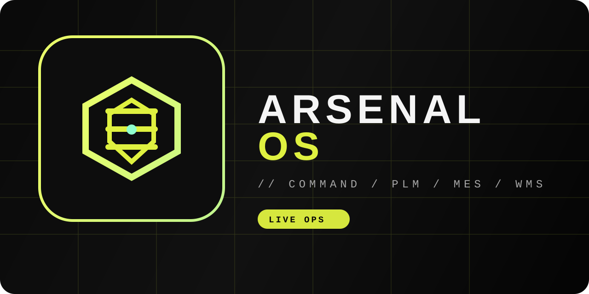

# ArsenalOS Anduril

An industrial command-and-control dashboard for modern manufacturing operations, designed to unify production visibility, lifecycle management, shop-floor execution, and supply chain awareness into one high-contrast operational interface.

## Hero



## Brand Assets

- Primary mark: [public/brand-mark.svg](public/brand-mark.svg)
- GitHub banner: [public/github-banner.svg](public/github-banner.svg)

## Why ArsenalOS Anduril

ArsenalOS Anduril is built for teams that need a clearer operational picture across the entire production system. It combines planning, execution, and logistics into a single tactical dashboard inspired by advanced control-room design principles.

### Core capabilities

- Real-time command center monitoring
- Product lifecycle and engineering BOM visibility
- Manufacturing execution workflows for active stations
- Inventory and logistics risk tracking
- High-contrast operational design for focused decision-making

## Feature Highlights

### 1. Command Center

A live operating overview with performance metrics, quality KPIs, and build event monitoring for high-level system awareness.

### 2. PLM View

Engineering-driven product structure, revision tracking, and component detail review across critical assemblies.

### 3. MES View

Station-by-station work instructions, anomaly reporting, and operator workflow controls for the production floor.

### 4. WMS View

Inventory health monitoring, critical shortages, and logistics feed visibility across inbound and outbound operations.

## Tech Stack

- React 19
- TypeScript
- Vite
- Recharts
- Framer Motion
- Lucide React

## Project Structure

```text
src/
├── App.tsx
├── index.css
├── main.tsx
├── assets/
├── components/
│   ├── DashboardView.tsx
│   ├── MESView.tsx
│   ├── PLMView.tsx
│   └── WMSView.tsx
└── ...
```

## Local Development

### Prerequisites

- Node.js 18+
- npm 9+

### Install

```bash
npm install
```

### Run locally

```bash
npm run dev
```

Then open the local Vite URL shown in the terminal.

### Production build

```bash
npm run build
```

### Preview production output

```bash
npm run preview
```

## Deployment

### Deploy to Vercel

1. Push the repository to GitHub.
2. Sign in to Vercel and choose Import Project.
3. Select this repository.
4. Use the following settings:
   - Framework Preset: Vite
   - Build Command: `npm run build`
   - Output Directory: `dist`
5. Click Deploy.

Vercel will automatically detect the Vite configuration and publish the project.

### Deploy to Netlify

1. Push the repository to GitHub.
2. In Netlify, click Add new site > Import an existing project.
3. Connect the repository.
4. Configure the build settings:
   - Build command: `npm run build`
   - Publish directory: `dist`
5. Deploy the site.

### Environment Notes

This project is a static front-end application, so no server-side environment variables are required for the default setup.

## Scripts

```bash
npm run dev
npm run build
npm run preview
npm run lint
```

## Design Philosophy

The interface is intentionally designed around a tactical operational aesthetic:

- dark industrial surfaces
- high-contrast telemetry panels
- bright production signals and status indicators
- immersive monitoring workflows for teams in motion

## License

This project is a front-end prototype for demonstration and operational UI concept exploration.

## Contributing

Contributions are welcome. For feature work or UI improvements, open a pull request with a short summary of the change and screenshots when relevant.